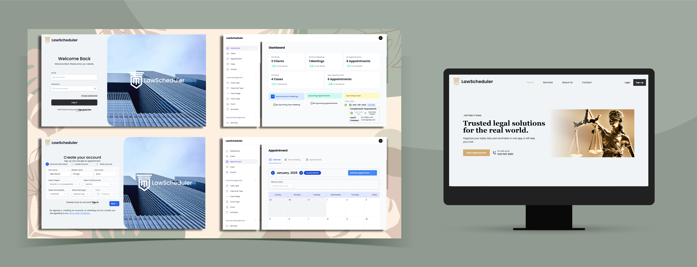

# LawScheduler - Law Office Scheduling and Case Tracking System

**LawScheduler** is a comprehensive **scheduling and case management system** built for a specific law office. Developed with **Laravel (TALL Stack)**, the system integrates with **Stripe** for payments, **Twilio** for SMS notifications, and the **Zoom API** for scheduling and managing virtual meetings. The system caters to three types of users: **clients**, **lawyers**, **admin**, and **secretaries**.

Visit the live app: [LawScheduler](https://lawscheduler.online/)

Deployed on **Hostinger**.

## Features

- **User Types**: 
  - **Clients**: Can create and track cases, schedule meetings with lawyers, and make payments for services.
  - **Lawyers**: Can view and manage cases, attend scheduled Zoom meetings, and update case statuses.
  - **Admins**: Have full access to the system, manage users, and monitor case progress.
  - **Secretaries**: Can assist with scheduling, manage meetings, and track case progress.

- **Scheduling Zoom Meetings**: 
  - Clients and Admins can schedule **Zoom meetings** for consultations and case updates.
  - Lawyers can join these virtual meetings directly from the system.
  
- **Case Status Tracking**: 
  - Clients can track the progress of their cases in real-time.
  - Lawyers and Admins can update case statuses, assign tasks, and monitor progress.

- **Payment Integration with Stripe**: 
  - Clients can securely make payments for legal services via **Stripe**.
  
- **SMS Notifications with Twilio**: 
  - **Twilio** integration for sending SMS notifications to clients, lawyers, and admins for important updates (meeting reminders, case updates, etc.).

- **Administrative Dashboard**: 
  - Admins can manage users (clients, lawyers, secretaries), monitor case statuses, and generate reports.

## Installation

### Prerequisites

Make sure the following tools are installed:

- **PHP** (version 7.4 or higher)
- **Composer** (for managing PHP dependencies)
- **MySQL** (or another supported database)
- **Node.js** (for compiling front-end assets)
- **Laravel** (latest stable version)
- **Stripe Account** (for payment integration)
- **Twilio Account** (for SMS notifications)
- **Zoom Account** (for Zoom API integration)

### Steps

1. Clone the repository:

    ```bash
    https://github.com/DevMike13/LawScheduler.git
    cd LawScheduler
    ```

2. Install PHP dependencies:

    ```bash
    composer install
    ```

3. Set up your environment file:

    Copy the `.env.example` to `.env`:

    ```bash
    cp .env.example .env
    ```

4. Set up your database:

    - Create a database in MySQL.
    - Configure your database settings in the `.env` file:

    ```bash
    DB_CONNECTION=mysql
    DB_HOST=127.0.0.1
    DB_PORT=3306
    DB_DATABASE=lawscheduler
    DB_USERNAME=root
    DB_PASSWORD=
    ```

5. Generate your application key:

    ```bash
    php artisan key:generate
    ```

6. Run the migrations to set up the database:

    ```bash
    php artisan migrate
    ```

7. Set up your **Stripe** API keys:
   - In the **Stripe** dashboard, create API keys and add them to your `.env` file:

    ```bash
    STRIPE_KEY=your-stripe-public-key
    STRIPE_SECRET=your-stripe-secret-key
    ```

8. Set up your **Twilio** API keys:
   - Create a Twilio account and get your API keys, then add them to your `.env` file:

    ```bash
    TWILIO_SID=your-twilio-sid
    TWILIO_TOKEN=your-twilio-auth-token
    TWILIO_FROM=your-twilio-phone-number
    ```

9. Set up your **Zoom** API keys:
   - Create a Zoom OAuth app to get your API keys and add them to the `.env` file:

    ```bash
    ZOOM_CLIENT_ID=your-zoom-client-id
    ZOOM_CLIENT_SECRET=your-zoom-secret
    ZOOM_ACCOUNT_ID=your-zoom-account-id
    ```

10. Install front-end dependencies:

    ```bash
    npm install
    ```

11. Compile the front-end assets:

    ```bash
    npm run dev
    ```

12. Start the development server:

    ```bash
    php artisan serve
    ```

13. Visit the app in your browser at `http://localhost:8000`.

## Usage

1. **Client**: 
   - **Create a case**: Clients can register, create a case, and upload necessary documents.
   - **Track case progress**: Clients can view updates on their case and the status assigned by the lawyer.
   - **Schedule a Zoom meeting**: Clients can schedule virtual meetings with their lawyer via Zoom.
   - **Make a payment**: Clients can pay legal fees via **Stripe** securely.

2. **Lawyer**: 
   - **View cases**: Lawyers can access all assigned cases and update case statuses.
   - **Join Zoom meetings**: Lawyers can attend scheduled Zoom meetings with clients.
   - **Update case statuses**: Lawyers can update the case status (e.g., "In Progress", "Completed").

3. **Admin**: 
   - **Manage users**: Admin can manage client, lawyer, and secretary accounts.
   - **Monitor case statuses**: Admin can view the progress of all cases and provide assistance as needed.
   - **Generate reports**: Admin can generate reports of payments, cases, and meeting schedules.

4. **Secretary**: 
   - **Assist with scheduling**: Secretaries can schedule meetings for clients and lawyers.
   - **Track case progress**: Secretaries can monitor case status updates and assist with organizing meetings.

## Stripe Payment Integration

The **Stripe** integration allows clients to make secure payments for legal services. Clients can complete their payments directly within the app using the **Stripe** API. The system supports various payment methods including credit and debit cards.

## Twilio SMS Integration

**Twilio** is used for sending SMS notifications. Clients, lawyers, and admins receive SMS reminders for meetings, case status updates, and any critical changes in the schedule or case.

## Zoom API Integration

The **Zoom API** allows the system to automatically create and schedule virtual meetings. Both **clients** and **admins** can schedule Zoom meetings, and **lawyers** can join them directly from the system.

## Technologies Used

- **Laravel (TALL Stack)**: 
  - **Tailwind CSS**: For responsive and modern UI design.
  - **Alpine.js**: For dynamic user interactions.
  - **Livewire**: For building dynamic interfaces without writing much JavaScript.
- **Stripe**: For payment processing.
- **Twilio**: For SMS notifications.
- **Zoom API**: For scheduling virtual meetings.
- **MySQL**: For database management.
- **PHP**: Backend logic and API integrations.

## Screenshots

Here’s how the **LawScheduler** app looks:




